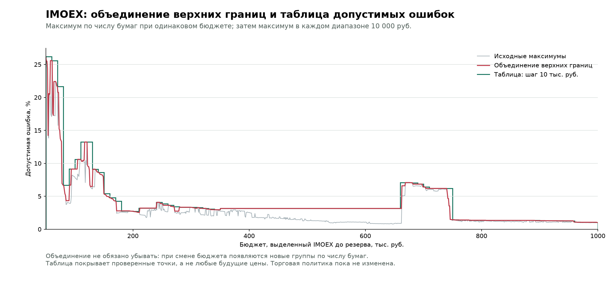

# IMOEX: верхние границы допустимого отклонения

## Назначение

Калибровочная таблица для будущей политики ребалансировки IMOEX. В `autorepeater/configs/imoex.json` как `allocation_drift_limits` записаны значения ниже, умноженные на 1.1: это согласованный запас 10% от значения порога. В этом документе, CSV, графиках и исходном JSON результата сохранены оценки до запаса, чтобы отделить калибровку от торговой настройки. Проверка и использование поля внесены в план, но пока не реализованы. Торговая логика не изменена: сейчас исполнитель проверяет объём заявок через threshold, а не отклонение весов. Подмена max_lot_weight_error этой таблицей была бы неверной: это другой критерий.

Бюджет — полная сумма, выделенная именно IMOEX, до его резерва 1%. В COMPOSITE это бюджет компонента, а не стоимость всего счёта.

Измеряется ложное контрольное отклонение: основная цель строится от полного бюджета, контрольная — от стоимости бумаг основной цели; обе оценены по одним ценам. Ошибка равна половине суммы модулей разниц нормализованных весов бумаг. Это не измерение реального рыночного ухода уже купленного портфеля от цели.

## Исходные данные

- 951,951 случаев; 1000 независимых случайных сценариев + исходные цены.
- Для каждого тикера независимо: от −10% до +10%, шаг 1%; seed 20261002.
- Бюджет 50 000–1 000 000 руб., шаг 1000 руб.; текущий IMOEX и сохранённые цены/лоты.
- 37 групп по числу бумаг (3–40, группа 28 отсутствует), 4984 точки.
- Группы могут перекрываться по бюджету; одинаковое число бумаг не гарантирует одинаковые тикеры.
- При построении границ хеши конфига, снимка и расчётчиков совпали с исходной калибровкой. После этого в конфиг добавлена таблица с запасом 1.1; остальные параметры и состав сохранены. Записанный хеш конфига относится к исходной версии без таблицы.

## Построение границы

Для каждой группы сортируем бюджеты и идём справа налево. Обозначим исходную ошибку fᵢ, новую границу gᵢ, бюджет Bᵢ. Ошибки храним в долях, ε = 0.00000001 (0.000001 процентного пункта).

```text
g_last = ceil(f_last / ε) × ε
g_i = max(ceil(f_i / ε) × ε, g_(i+1) + ε × (B_(i+1) − B_i) / 1000)
```

Это минимальная верхняя граница на выбранной десятичной сетке при снижении не менее ε на каждые 1000 руб. Без минимального шага единственной наименьшей строго убывающей границы не существует. Здесь шаг технический, а не дополнительный запас на торговлю. Подъём исходных точек нужен, чтобы покрыть все более поздние всплески внутри той же группы; визуально некоторые участки будут выглядеть плоскими.

Границы строятся только на наблюдавшихся бюджетах каждой группы; в отсутствующих точках группа не участвует в объединении. Пропуски не соединяются на графиках, экстраполяции нет.

Затем G(B) = max(g_N(B)) по всем имеющимся группам при том же бюджете. У результата 17 подъёмов: появляются другие группы. По согласованному правилу объединения они сохранены, глобальное сглаживание не применялось.

Таблица берёт максимум G(B) по проверенным точкам каждого диапазона 10 000 руб. Диапазоны [от, до), последний включает 1 000 000 руб. Ни интерполяция между шагами 1000 руб., ни перенос за пределы диапазона не подтверждены калибровкой. Для них пока нет согласованного порога.

## Проверки и ограничения

- Все 4984 границы не ниже исходных значений; все 37 кривых строго убывают.
- В каждой из 951 общей точки использован точный максимум доступных границ.
- Все 95 диапазонов покрывают свои проверенные точки без округления вниз.
- Расчёт выполнен через Decimal; значения JSON — строки в долях, не в процентах.
- Округление таблицы в этом документе вверх до 0.01 процентного пункта, только для чтения.
- Это эмпирические максимумы, не статистическая гарантия. Выборка ещё не показала сходимость.
- Такая граница может скрыть настоящее отклонение меньшей величины; включение её в торговую политику потребует проверки сценариев пополнения и реального ухода цен.

## Графики и данные



- [Все 37 кривых](20261002-imoex-drift-envelopes-curves.png)
- [Увеличенная страница 1](20261002-imoex-drift-envelopes-curves-01.png)
- [Увеличенная страница 2](20261002-imoex-drift-envelopes-curves-02.png)
- [Увеличенная страница 3](20261002-imoex-drift-envelopes-curves-03.png)
- [Увеличенная страница 4](20261002-imoex-drift-envelopes-curves-04.png)
- [Увеличенная страница 5](20261002-imoex-drift-envelopes-curves-05.png)
- [Исходные точки и границы каждой группы, CSV](20261002-imoex-drift-envelopes-curves.csv)
- [Объединение по каждому шагу 1000 руб., CSV](20261002-imoex-drift-envelopes-combined.csv)
- [Таблица IMOEX с точными значениями и метаданными, JSON](20261002-imoex-drift-envelopes-table.json)

## Таблица допустимых ошибок IMOEX

| Бюджет IMOEX, руб. | Допустимая ошибка, % |
|---|---:|
| 50,000–60,000 | 26.17 |
| 60,000–70,000 | 25.58 |
| 70,000–80,000 | 21.66 |
| 80,000–90,000 | 6.68 |
| 90,000–100,000 | 9.13 |
| 100,000–110,000 | 10.61 |
| 110,000–120,000 | 13.24 |
| 120,000–130,000 | 13.24 |
| 130,000–140,000 | 9.12 |
| 140,000–150,000 | 8.64 |
| 150,000–160,000 | 5.39 |
| 160,000–170,000 | 4.77 |
| 170,000–180,000 | 4.27 |
| 180,000–190,000 | 2.79 |
| 190,000–200,000 | 2.79 |
| 200,000–210,000 | 2.74 |
| 210,000–220,000 | 3.21 |
| 220,000–230,000 | 3.21 |
| 230,000–240,000 | 3.21 |
| 240,000–250,000 | 4.09 |
| 250,000–260,000 | 3.89 |
| 260,000–270,000 | 3.64 |
| 270,000–280,000 | 3.42 |
| 280,000–290,000 | 3.34 |
| 290,000–300,000 | 3.34 |
| 300,000–310,000 | 3.32 |
| 310,000–320,000 | 3.29 |
| 320,000–330,000 | 3.17 |
| 330,000–340,000 | 3.06 |
| 340,000–350,000 | 2.97 |
| 350,000–360,000 | 3.16 |
| 360,000–370,000 | 3.16 |
| 370,000–380,000 | 3.15 |
| 380,000–390,000 | 3.15 |
| 390,000–400,000 | 3.15 |
| 400,000–410,000 | 3.15 |
| 410,000–420,000 | 3.15 |
| 420,000–430,000 | 3.15 |
| 430,000–440,000 | 3.15 |
| 440,000–450,000 | 3.15 |
| 450,000–460,000 | 3.15 |
| 460,000–470,000 | 3.15 |
| 470,000–480,000 | 3.15 |
| 480,000–490,000 | 3.15 |
| 490,000–500,000 | 3.15 |
| 500,000–510,000 | 3.15 |
| 510,000–520,000 | 3.15 |
| 520,000–530,000 | 3.15 |
| 530,000–540,000 | 3.15 |
| 540,000–550,000 | 3.15 |
| 550,000–560,000 | 3.15 |
| 560,000–570,000 | 3.15 |
| 570,000–580,000 | 3.15 |
| 580,000–590,000 | 3.15 |
| 590,000–600,000 | 3.15 |
| 600,000–610,000 | 3.15 |
| 610,000–620,000 | 3.15 |
| 620,000–630,000 | 3.15 |
| 630,000–640,000 | 3.15 |
| 640,000–650,000 | 3.15 |
| 650,000–660,000 | 3.15 |
| 660,000–670,000 | 7.09 |
| 670,000–680,000 | 7.09 |
| 680,000–690,000 | 7.06 |
| 690,000–700,000 | 6.85 |
| 700,000–710,000 | 6.42 |
| 710,000–720,000 | 6.19 |
| 720,000–730,000 | 6.19 |
| 730,000–740,000 | 6.19 |
| 740,000–750,000 | 6.19 |
| 750,000–760,000 | 1.45 |
| 760,000–770,000 | 1.40 |
| 770,000–780,000 | 1.40 |
| 780,000–790,000 | 1.36 |
| 790,000–800,000 | 1.36 |
| 800,000–810,000 | 1.36 |
| 810,000–820,000 | 1.34 |
| 820,000–830,000 | 1.34 |
| 830,000–840,000 | 1.34 |
| 840,000–850,000 | 1.34 |
| 850,000–860,000 | 1.35 |
| 860,000–870,000 | 1.35 |
| 870,000–880,000 | 1.35 |
| 880,000–890,000 | 1.35 |
| 890,000–900,000 | 1.34 |
| 900,000–910,000 | 1.31 |
| 910,000–920,000 | 1.30 |
| 920,000–930,000 | 1.30 |
| 930,000–940,000 | 1.30 |
| 940,000–950,000 | 1.28 |
| 950,000–960,000 | 1.28 |
| 960,000–970,000 | 1.10 |
| 970,000–980,000 | 1.06 |
| 980,000–990,000 | 1.06 |
| 990,000–1,000,000 включительно | 1.06 |
